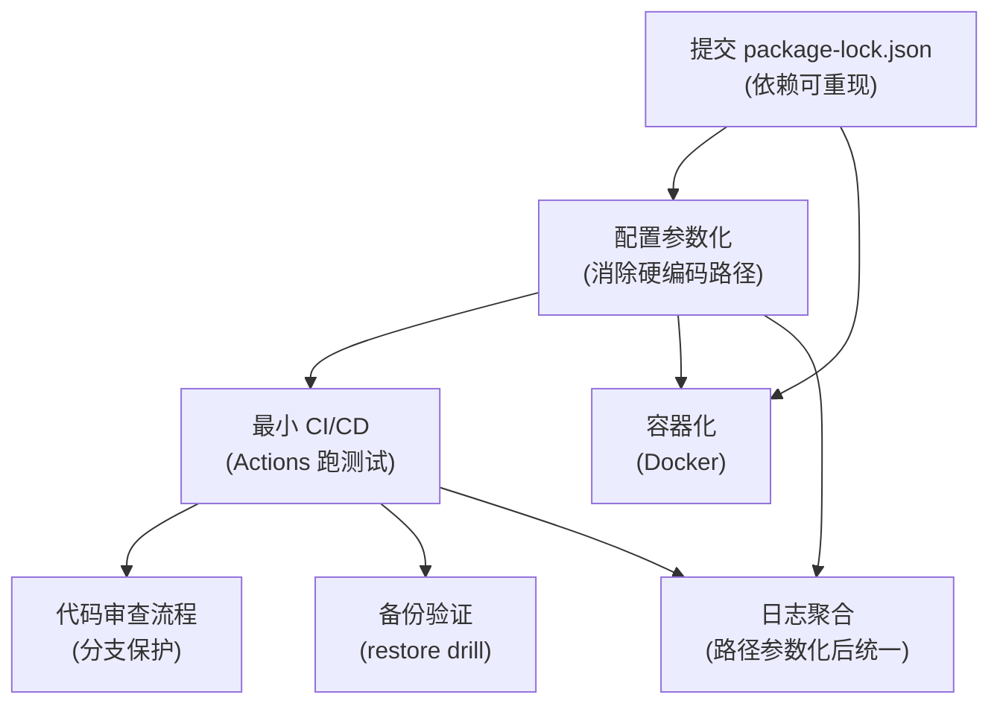

# 巨量引擎监控 - 工程化优化方案

> 日期：2026-07-25
> 目标：将项目从「能在本地跑」提升到「可重现、可移植、可自动验证」
> 用途：本文档汇总当日讨论的七项工程化改进点，标注进度与实施指南，供执行工具落地未完成项。

---

## 一、背景

将本项目与标准私有项目对照后，识别出七项工程化短板。项目在容错降级、安全实践、架构决策论证上已达到甚至超过标准私有项目水位，本方案聚焦工程交付流程的最后一公里。

七项改进点之间存在明确的依赖链，需按序推进。

---

## 二、七项改进点与依赖链

### 依赖关系图

### 三条关键依赖

1. **package-lock.json 是地基。** .gitignore 原本排除了它，换台机器 npm install 可能装出不同 better-sqlite3 版本，而项目存在 Node 22(ABI 127) vs Node 24(ABI 137) 的原生模块冲突。依赖不可重现，CI 结果就不可信。

2. **配置参数化是枢纽。** ecosystem.config.cjs 原本硬编码项目绝对路径和 Node 绝对路径，任何非本机环境（CI runner、容器）都会直接挂。不参数化，CI 和容器化都无法推进。

3. **CI/CD 是放大器。** 有了可重现依赖和可移植配置后，CI 接上即可自动跑测试，又是代码审查和备份验证的支点。

---

## 三、当前进度

| # | 改进项 | 状态 | 产出文件 |
|---|--------|------|----------|
| 1 | 提交 package-lock.json | 已完成 | .gitignore（已移除忽略） |
| 2 | 配置参数化 | 已完成 | ecosystem.config.cjs、.env.example |
| 3 | 日志聚合 | 已完成 | logger.mjs、monitor-utils.mjs |
| 4 | 最小 CI/CD | 已完成 | scripts/ci-test.mjs、.github/workflows/ci.yml |
| 5 | 备份验证 | ✅ 已完成 | scripts/backup-verify.mjs（双模式：本地 integrity check + CI 灾备演练） |
| 6 | 容器化 | 未开始 | - |
| 7 | 代码审查流程 | 未开始 | - |

---

## 四、推荐执行顺序

已完成日志聚合、配置参数化后，剩余四项按「投入产出比 × 依赖关系」排序：

1. **提交 package-lock.json** - ✅ 已完成
2. **最小 CI/CD** - ✅ 已完成
3. **备份验证** - ✅ 已完成
4. **容器化** - 按需
5. **代码审查流程** - 最低优先级（单人项目价值有限）

核心结论：锁依赖 -> 接 CI -> 备份验证，这三步已形成最小可行工程闭环。容器化和代码审查按需推进，不阻塞主线。
---

## 五、已完成项详情（备查）

### 5.1 提交 package-lock.json

- 从 .gitignore 移除 package-lock.json，纳入版本控制，保证依赖版本可重现。
- .env 仍被忽略（敏感配置不入库）。

### 5.2 配置参数化

- ecosystem.config.cjs 三处硬编码改为环境变量优先，本机零配置可用：
  - MONITOR_DIR = process.env.MONITOR_DIR || __dirname
  - NODE = process.env.NODE_EXE || 本机 Node 22 绝对路径
  - LOG_DIR 同样参数化
- monitor-utils.mjs 中 FEEDBACK_PORT、DAILY_BUDGET、Chrome 路径、飞书排班表配置等均改为环境变量优先。
- .env.example 补齐 MONITOR_DIR、NODE_EXE、LOG_RETENTION_DAYS、Chrome/排班表等配置项说明。

### 5.3 日志聚合

- 新建 logger.mjs（零依赖统一日志模块），双写：
  - 纯文本 monitor-data/monitor.log（[时间] [LEVEL] [module] 前缀，兼容 monitor-daemon 正则扫描）
  - 结构化 monitor-data/logs/monitor-YYYY-MM-DD.ndjson（JSON 行，按日轮转，LOG_RETENTION_DAYS 控制保留期，默认 14 天）
- installConsoleInterceptor() 在 monitor-utils.mjs 全局安装，所有 import monitor-utils 的脚本零改动接入。
- 移除了 oceanengine-monitor-v3.mjs 的 console 二次劫持（原与 monitor-utils 重复劫持）。
- oceanengine-daily-report-scheduler.mjs 改用 createLogger('日报')，顺带修复了原代码 log() 先于 LOG 定义的 TDZ 隐患。

### 5.4 最小 CI/CD

- scripts/ci-test.mjs：CI 测试运行器，逐个运行纯逻辑测试（csrf、autonomous-router、feishu-push-guard），15s 超时控制，处理「测试通过但进程不退出」的问题（检查输出标记）。
- .github/workflows/ci.yml：两个 job
  - test：push/PR/schedule 触发，npm ci + node scripts/ci-test.mjs
  - backup-verify：同触发条件，node scripts/backup-verify.mjs（当前引用的是 0 字节空文件，见第六节）
- 测试为自定义格式（非 node:test），csrf-http 需端口、refresh-materialized 依赖数据库，均不纳入 CI。

---

## 六、待执行项实施指南

> 以下为未完成项的详细规格，供执行工具直接实现。

### 6.1 备份验证（✅ 已完成）

**状态：** 2026-07-25 已实现，双模式验证通过。

**实现文件：** scripts/backup-verify.mjs（340 行）

**验证结果（2026-07-25）：**

| 模式 | 校验项 | 结果 |
|------|--------|------|
| 本地 | PRAGMA integrity_check | ok（32.4MB 真实库）
| 本地 | PRAGMA quick_check | ok
| 本地 | PRAGMA foreign_key_check | 0 违规
| 本地 | 6 张关键表行数 | campaigns:120 / snapshots:21983 / alerts:2 / actions:0 / feedback:2 / config:6
| 本地 | snapshots 抽样最新 3 条 | 数据可读，值正常
| CI | schema.sql 建库 | 成功
| CI | 测试数据插入（2 campaigns, 3 snapshots, 1 alert） | 成功
| CI | 备份文件（81920 字节） | 完成
| CI | 删除原库 → 恢复 | 文件大小一致
| CI | 恢复后 integrity_check | ok
| CI | 恢复后表结构（6 张表） | 全部存在
| CI | 恢复后数据一致性（行数/ID/cost） | 全部一致（¥630.50）
| 两种模式 | 退出码 | 0 = 全部通过

**设计实现：**
- **自动环境检测**：`fs.existsSync(DB_PATH)` 判断走本地/CI 分支
- **零污染**：本地模式复制到临时目录验证，不碰原库
- **CI 6 阶段闭环**：建库 → 插数据 → 备份 → 删库 → 恢复 → 验证
- **依赖**：仅 better-sqlite3（已有）+ node:fs/path/os 标准库
### 6.2 容器化（按需）

**前置条件：** 依赖锁定 + 配置参数化已就绪。

**目标：** 用 Docker 解决 better-sqlite3 的 ABI 绑定问题（Node 22 vs 24），实现环境一致性。

**需产出：**

- Dockerfile：基于 node:22 镜像，npm ci 安装依赖（利用已提交的 lockfile），预编译 better-sqlite3
- .dockerignore：排除 monitor-data/、node_modules/、.git/、*.db、archive/
- 可选 docker-compose.yml：挂载 monitor-data/ 持久化运行时数据

**关键注意点：**

- 项目依赖本地 Chrome CDP（chrome-guard.mjs、cdp-client.mjs 通过 9222 端口控制 Chrome），容器内跑 Chrome 需额外安装 Chromium 并配置 --no-sandbox、--remote-debugging-port=9222，复杂度较高。
- 部分进程（feishu-listener、feedback-server）依赖网络与飞书 CLI，容器化时需确认这些外部依赖可用。
- 建议分阶段：先容器化纯计算/数据进程（15min 监控、日报、5min 检查），Chrome 相关进程暂留宿主机。
- ecosystem.config.cjs 已参数化，容器内通过环境变量注入 MONITOR_DIR、NODE_EXE 即可。

**验收：** 容器内 node scripts/ci-test.mjs 通过；容器内 better-sqlite3 不报 ABI 错误。

### 6.3 代码审查流程（最低优先级）

**适用判断：** 单人项目价值有限，等有多人协作或 CI 稳定运行后再上。

**实施步骤（GitHub 仓库设置）：**

1. 仓库 Settings -> Branches -> Add branch protection rule
2. Branch name pattern：main（或 master）
3. 勾选：
   - Require status checks to pass before merging
   - 选择 test job 为必需检查
   - Require branches to be up to date before merging
4. 可选：Require a pull request before merging（单人可跳过）
5. 可选：Require conversation resolution before merging

**前置条件：** 必须先将代码推送到 GitHub 远程仓库（当前仓库无 remote）。CI 在 GitHub runner 上跑通后再启用分支保护，否则会阻塞提交。

---

## 七、卡点说明

~~scripts/backup-verify.mjs 无法生成的原因：本机 Codex 使用的是固定模型接口（非 Codex 原生模型），在生成大段代码文件（PowerShell here-string 或长内容 patch）时频繁触发 stream disconnected before completion: Invalid request body 错误，导致脚本写入为 0 字节。~~

~~本方案文档即为应对该卡点的替代策略：将完整方案固化为文档，交由其他工具执行落地。~~

**2026-07-25 已解决**：使用 CodeBuddy Code 工具成功实现 scripts/backup-verify.mjs（340 行），双模式全部通过验证。本地模式对 32.4MB 真实数据库执行 integrity_check + 表行数校验；CI 模式完成 schema 建库→备份→删除→恢复→验证 6 阶段闭环。

---

## 八、验收清单

- [x] scripts/backup-verify.mjs 实现完整，本地跑通真实库验证
- [x] CI 无真实库时走 schema 分支，完成「备份-删除-恢复-验证」闭环
- [ ] .github/workflows/ci.yml 的 backup-verify job 在 GitHub runner 上跑通（需 push 到 GitHub remote 后触发）
- [ ] （按需）Dockerfile 构建成功，容器内 CI 测试通过
- [ ] （按需）GitHub 仓库启用分支保护，test 检查为必需
