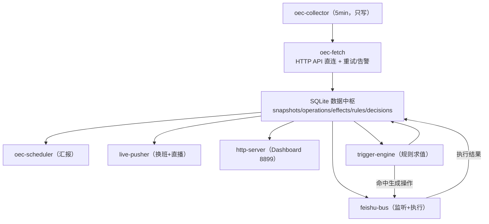

# 巨量引擎监控 · 方案整合总纲 v2.0

> 日期：2026-08-01
> 定位：**唯一入口文档** —— 整合方案主体（完整重构 S 系列 + 数据中枢 D 系列）与全部专项说明（运行逻辑 / 远程访问手册 / 快照明细字段全量档案 / 日志规范 / 当日换班校对 / 学习期推断规则 / 数据保留策略）
> 配套：`数据中枢与AI调优架构设计.md`（表结构 DDL 与触发引擎细节）、`完整重构方案_20260801.md`（S 系列实施细节）、`前端数据抓取重构方案.md`（采集链路收敛）

---

## 一、文档地图

| # | 内容 | 本总纲章节 | 详细文档 |
|---|---|---|---|
| 1 | 完整重构方案（S 系列） | 二.1 | `完整重构方案_20260801.md` |
| 2 | 数据中枢与 AI 调优（D 系列） | 二.2 | `数据中枢与AI调优架构设计.md` |
| 3 | 项目完整文档（环境/目标/模块） | 二.3 | `巨量引擎监控-项目完整文档_20260801.md` |
| 4 | 远程访问手册 | 四 | —（本总纲落盘） |
| 5 | 运行逻辑说明 | 三 | —（本总纲落盘） |
| 6 | 快照明细字段全量档案 | 五 | —（本总纲落盘） |
| 7 | 日志规范 | 六 | `AGENTS.md`（强制规范）+ `logger.mjs` / `scripts/log-change.mjs` |
| 8 | 当日换班校对 | 七 | 数据中枢文档 3.3.2 |
| 9 | 学习期推断规则 | 八 | 数据中枢文档 3.2 / AI诊断规则手册（待补） |

---

## 二、方案主体（整合）

### 2.1 完整重构方案（S 系列）

**核心目标**：目录分层、模块化、去重、进程合并、配置外置、测试强化。

- **目标目录**：`src/` 分层骨架 —— `config → platform（oec-*）→ domain（纯逻辑）→ services（瘦编排）→ web / db / feishu / cdp / utils`
- **依赖规则**：`platform` 只依赖 `utils/config`；`domain` 不 import `platform`（数据参数注入）；`services` 只做编排；禁止跨层 import（CI 用 `scripts/check-imports.mjs` 拦截）
- **进程合并**：12 → ≤6（cron 6 进程 → `oec-scheduler`；shift-pusher+live-watcher → `live-pusher`；feishu-listener+action-queue-worker → `feishu-bus`；feedback-server → `http-server`；chrome-guard 保留）
- **主题清单**：A 目录重组 / B 采集链路收敛（已被 D 吸收）/ C 巨型文件拆分 / D 服务层统一 / E 数据库统一 / F 配置管理 / G 调度守护统一 / H 测试与 CI / I 多租户 / J 文档治理 / K 远程运维通道治理

### 2.2 数据中枢与 AI 调优（D 系列）

**目标形态**：采集独立（`oec-collector` 只写库）→ SQLite 数据中枢（唯一事实源）→ 汇报/监控/规则引擎全部读库。

- **抓取策略（2026-08-01 决策）**：生产抓取仅 **HTTP API 直连** 唯一路径；失败 → **每分钟重试（窗口内最多 5 次）→ 飞书群告警 → 持续重试 + 恢复通知**；401/403 先自动刷新 Cookie 再重试。CDP 仅保留：Cookie 提取/刷新、写操作执行、逆向工具（不再用于抓取降级）。
- **数据模型**：`snapshots`（5min 粒度 + `account_id` + `learning_status`/`learning_done`）；新增 `shifts` / `operations` / `operation_effects` / `trigger_rules` / `ai_decisions`
- **调优闭环**：`trigger_rules`（条件配置）→ trigger-engine（采集完成事件驱动）→ `operations`（状态机 proposed→pending→confirmed→executing→succeeded/failed→rolled_back）→ `operation_effects`（15/30/60/120min 多窗口）→ 回写规则 `success_rate`
- **AI 自动执行安全边界**：审批兜底（auto 仅低风险：预算下调/暂停）、冷却、日上限、互斥、参数护栏、熔断、一键回滚、全量审计；`learning_done=0` 禁止/延迟调优

### 2.3 项目完整文档（环境/目标/模块）

见 `巨量引擎监控-项目完整文档_20260801.md`：Node 22.22.2 + PM2 12 进程、SQLite/Chrome CDP/lark-cli/8899、9 表 + 3 物化视图、功能模块清单（采集/汇报/操作/服务/基础设施/数据库/辅助）。

### 2.4 路线图总览

| 阶段 | 内容 | 依赖 |
|---|---|---|
| S0 | 冻结基线（PM2/DB/卡片样例 + git 标签） | — |
| S1 | 安全清理（临时脚本/日志/备份归档） | S0 |
| S1.5 | 远程通道治理（密码进 .env、健康监控、README 手册） | S1 |
| S2 | 基础设施（数据库统一、配置外置、monitor-data 分区） | S1 |
| S3 | 采集收敛（oec-session/http/normalize，→ D1 前置） | S2 |
| S4 | 业务拆分（monitor-v3/5min-check/feedback-server；删旧前端） | S2 |
| D0 | 数据模型（schema 迁移 + account_id + operations 视图兼容双写） | 与 S4 并行 |
| D1 | 采集器独立（oec-collector + 卡片/汇总改读库 + purge-data 保留策略） | S3 + S4 |
| D2 | 操作闭环入库（operations/effects 替换文件队列与 audit） | D0 |
| D3 | 规则引擎（trigger_rules + trigger-engine，confirm 模式） | D0 + D1 |
| S5 | 进程合并（12 → 6） | S4 + D2 |
| S6 | 测试强化（单测 ≥30 + windows CI + import 检查） | S5 |
| D4 | AI 自动执行灰度（auto 低风险 + 效果回写） | D3 |
| S7 | 多租户（accounts.json + 数据/推送隔离） | 与 D4 并行 |

---

## 三、运行逻辑说明

### 3.1 运行架构总览



### 3.2 四个核心链路

1. **采集链路**：`oec-collector` 每 5min → `oec-fetch`（HTTP API 直连，失败每分钟重试 → 飞书告警 → 恢复通知）→ `oec-normalize` 统一解析（含学习期推断）→ upsert 写 `snapshots`（幂等）→ 采集完成事件触发 trigger-engine。
2. **汇报链路**：5min 速报卡 / 15min 完整卡（3×5min 窗口聚合，不足标注 `partial`）/ 日汇总与日报（读 `daily_stats`/`hourly_stats`）/ Dashboard 全部走 `dal.mjs` 读库。
3. **操作链路**：飞书群指令 → `feishu-bus` 解析 → `operations(proposed)` → 确认卡片 → `confirmed→executing` → `oec-actions`（HTTP API 主 / CDP 备）执行 → 回读 before/after → `succeeded/failed`；`effect-tracker` 异步算 `operation_effects`（15/30/60/120min 窗口，阈值从 `config` 表读取）。
4. **AI 调优链路**：`trigger_rules` 求值（`learning_done=0` 跳过调优）→ 冷却/互斥/日上限检查 → `ai_decisions` + `operations` → confirm/auto → 执行 → 效果回写 `success_rate` → 低分规则自动停用。

### 3.3 进程视角（重构后 6 进程）

| 进程 | 职责 | 合并来源 |
|---|---|---|
| `oec-scheduler` | 采集 + 全部定时汇报 + 规则触发 | 6 个 cron 进程 + adaptive/trigger-engine |
| `live-pusher` | 换班推送 + 直播状态 | shift-pusher + live-watcher |
| `feishu-bus` | 群监听 + 操作执行 | feishu-listener + action-queue-worker |
| `http-server` | Dashboard + REST API（8899） | feedback-server |
| `chrome-guard` | Chrome 9222 守护 | 保留 |
| `web`（可选） | 分离部署 | — |

### 3.4 一天运行时间线（排班驱动）

```
非排班时段（无预定直播）  低活跃期：30min 低频采集或暂停（数据陈旧 >1h 立即补采）
排班时段内               有消耗 → 5min 高频；无消耗 → 15min 中频
21:30                   AI 区域号汇总（读库 → 推送）
23:00                   排班同步 + 当日排班/换班校对（sync-shifts，详见第七章）
23:05                   日报（读 daily_stats/hourly_stats）
23:35                   日汇总（核对 → 推送 → 写标记）
04:00                   purge-data 数据保留清理（每日低峰）
任意时刻                群指令 / Dashboard 操作 / 规则自动触发 → operations 闭环
```

---

## 四、远程访问手册

### 4.1 机制现状

| 项 | 说明 |
|---|---|
| 网关 | CodeBuddy `settings.json` → `gateway: { auth: "password" }`，密码保护 Web UI |
| 隧道 | cloudflared trycloudflare 快速隧道（2 进程常驻），本地 CodeBuddy Web 服务端口 → 公网 `https://<随机>.trycloudflare.com/?password=***` |
| 状态文件 | `C:\Users\HTF2026\.codebuddy\tunnel-state.json`（url / localPort / cliPid） |
| 地址记录 | `E:\炼丹炉\WorkBuddy\网关地址.txt`（Web UI / Tunnel / 本地三地址） |

### 4.2 获取最新访问地址

1. 查看 `E:\炼丹炉\WorkBuddy\网关地址.txt`（含 Web UI 带密码地址、Tunnel 地址、本地地址）。
2. 或查看 `C:\Users\HTF2026\.codebuddy\tunnel-state.json` 中 `tunnels.*.url`。
3. 地址变化时，`check_gateway_hook.sh`（CodeBuddy Stop 事件）自动推飞书私聊，无需手动关注。

### 4.3 访问方式

- **CodeBuddy Web UI / webCLI**：浏览器打开 Web UI 地址（带 `?password=`）→ 远程操作本机（pm2、日志、监控命令）。
- **监控 Dashboard（可选）**：`https://<tunnel>/dashboard-v2?password=<pwd>` 或本地 `http://<局域网IP>:8899/dashboard-v2`（地址拼接逻辑见 `send_gateway_to_feishu.py`）。
- **本地访问**：`http://192.168.1.5:8899/dashboard-v2`。

### 4.4 决策记录（2026-08-01）

**不采用固定域名/固化地址方案**（无固定公网域名等环境条件）。远程通道维持 trycloudflare 动态隧道 + 地址变更飞书通知，仅做治理与安全加固。

### 4.5 安全注意事项

- 隧道密码与飞书通知凭据**移入 `.env`**（不写死脚本），定期轮换 `gateway.password`。
- 远程会话建议只读；Dashboard 走隧道时强制密码 + CSRF（复用 `csrf-utils.mjs`）。
- 确认 `网关地址.txt` / `.gateway_last_url.txt` 等明文文件访问权限。
